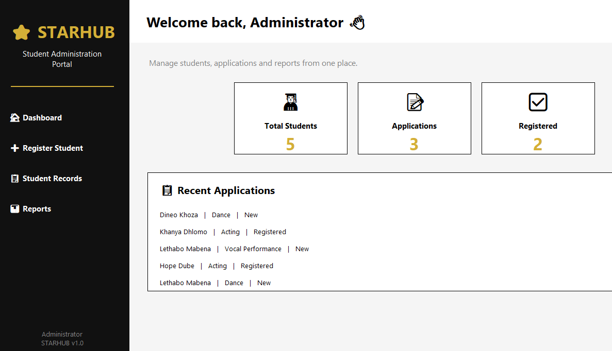
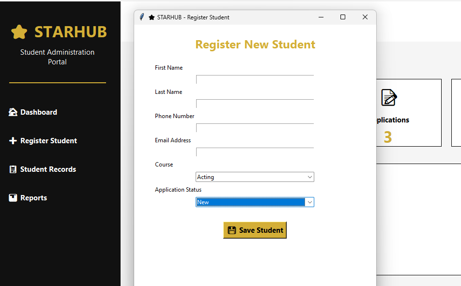
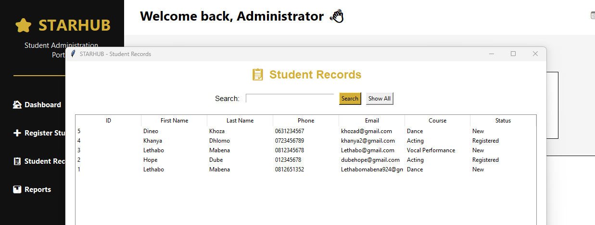

# ⭐ STARHUB - Student Administration System



## Overview

STARHUB is a desktop-based **Student Administration System** developed using **Python, Tkinter, and SQLite**.

The project was created to demonstrate how technology can support educational administration by improving student registration, record management, and reporting processes.

The system simulates a real-world college administration environment where staff can manage student information efficiently and access important administrative data through a simple user-friendly interface.

---

# ✨ Features

## 🏠 Dashboard


The dashboard provides administrators with a quick overview of student information.

Features include:
- Total number of students
- New applications
- Registered students
- Quick navigation to different system modules

---

## ➕ Student Registration



The registration module allows administrators to capture and store student information.

Information collected:
- First name
- Last name
- Phone number
- Email address
- Course
- Student status

All information is stored securely in the SQLite database.

---

## 📋 Student Records



The student records module allows administrators to view and manage student information.

Features include:
- Displaying all registered students
- Searching students by name or course
- Viewing stored student details
- Organised database records

---

# 🛠 Technologies Used

- Python
- Tkinter (Graphical User Interface)
- SQLite Database
- Git
- GitHub

---

# 📂 Project Structure

```
STARHUB/
│
├── dashboard.py
├── database.py
├── students.py
├── record.py
├── reports.py
├── sqca_database.db
├── README.md
│
└── images/
    ├── dashboard.png
    ├── registration-page.png
    └── student-database.png
```

---

# 💡 Development Purpose

STARHUB was developed as a personal portfolio project to explore how software can improve administrative processes within educational institutions.

The project demonstrates my ability to:
- Design and develop a desktop application
- Create database-driven systems
- Manage and organise information
- Build user-friendly interfaces
- Apply programming concepts to solve real-world problems

---

# 📚 Skills Demonstrated

- Database Management
- User Interface Design
- Python Programming
- Problem Solving
- Software Development
- Data Organisation
- Version Control using Git and GitHub

---

# 🚀 Future Improvements

Planned improvements include:

- User login and authentication
- Edit and delete student records
- Export reports to PDF/Excel
- More advanced analytics dashboards
- Student profile images
- Cloud database integration

---

# 👨‍💻 Author

**Lethabo Mabena**

GitHub:
https://github.com/lethabomabena924-droid
